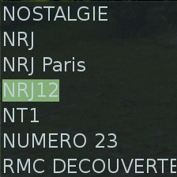

DVB-T/DAB-T player
=================

Description
-----------

This KDE plasmoid uses mplayer in order to play digital content from a dvb tunner device. It is written
in C++ and Qt/QML. 

The channels are read from /etc/mplayer/channels.conf file that must be generated 
using [dvb-t_scanner utility](https://github.com/cristeab/dvb-t_scanner). Double click a channel name 
on the list to start playing, double click again to stop playing. mplayer is started 
with the following arguments:

 mplayer -ao sdl dvb://"channel name"

Plugin Compilation and Installation
-----------------------------------

A QML plugin (shared library) is needed in order to start mplayer process and read the channel configuration
file. From the main directory of the project:

    cd plugins
    mkdir build
    cd build
    cmake ..
    make
    sudo make install

Plasmoid Package Creation and Installation
------------------------------------------

In order to install the plasmoid on local kde folder, from the main directory of the project:

  cd plasmoid
  zip -r ../dvbplayer.plasmoid .
  plasmapkg -i dvbplayer.plasmoid
